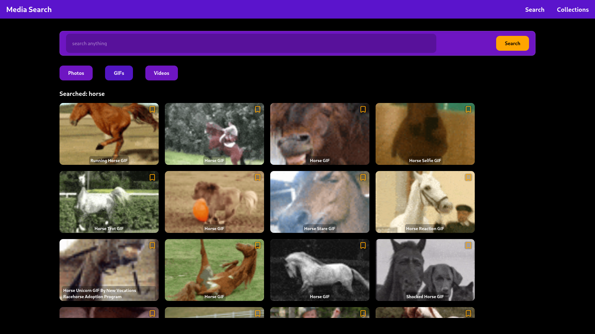
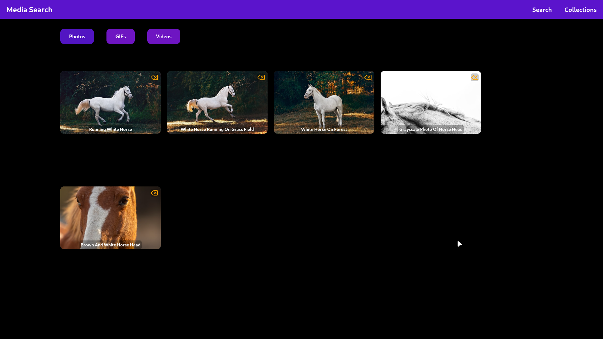
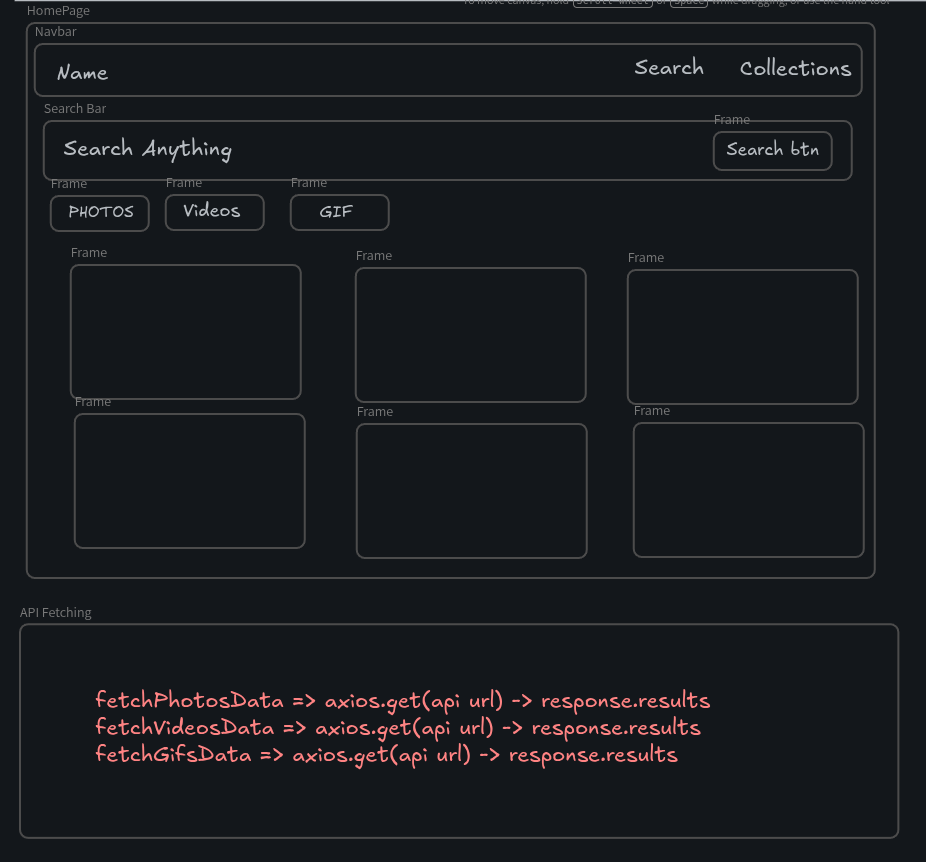
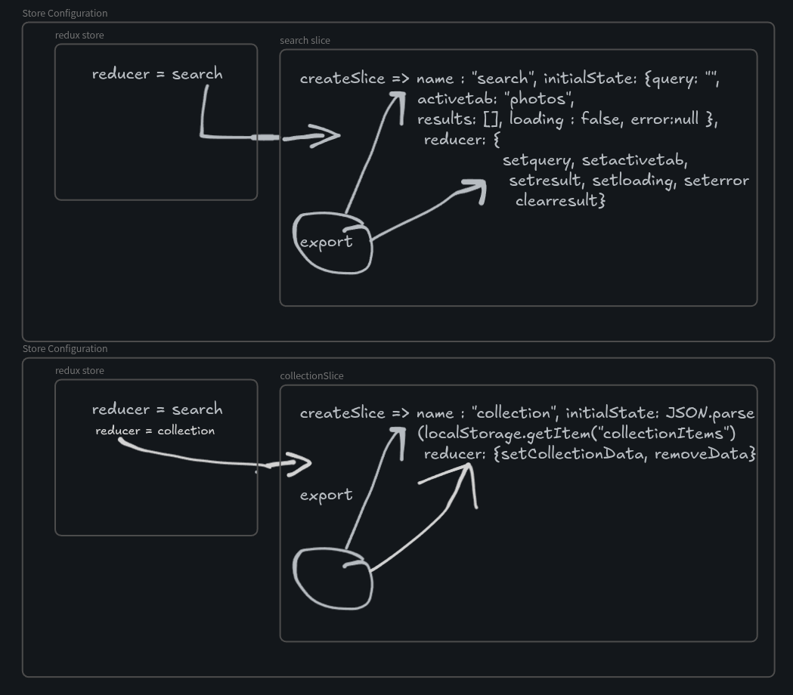
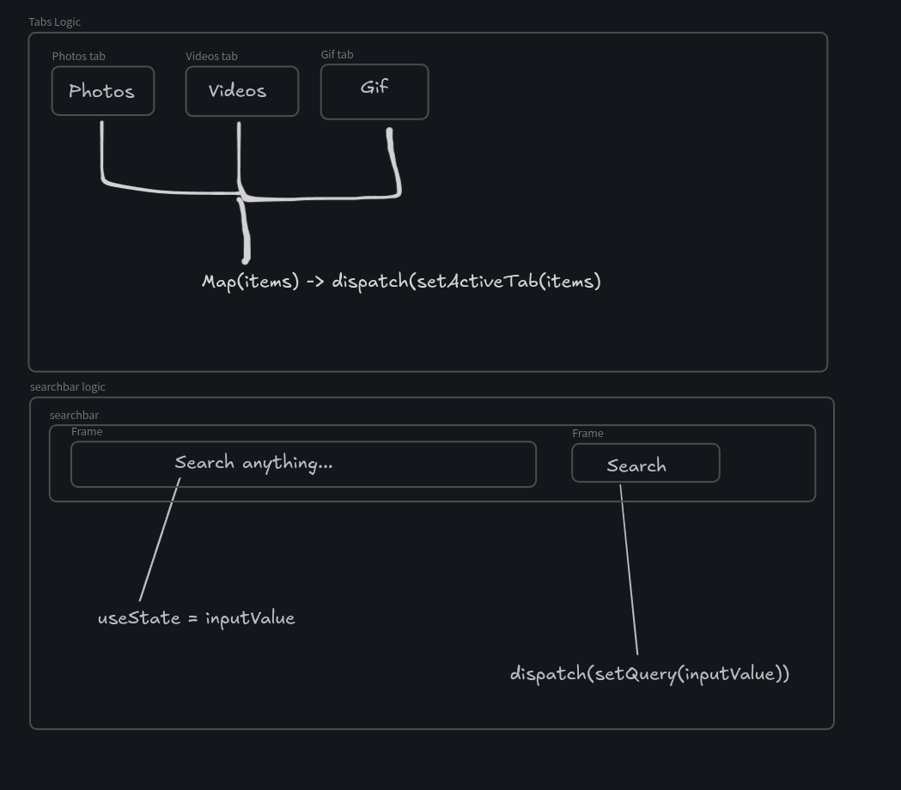
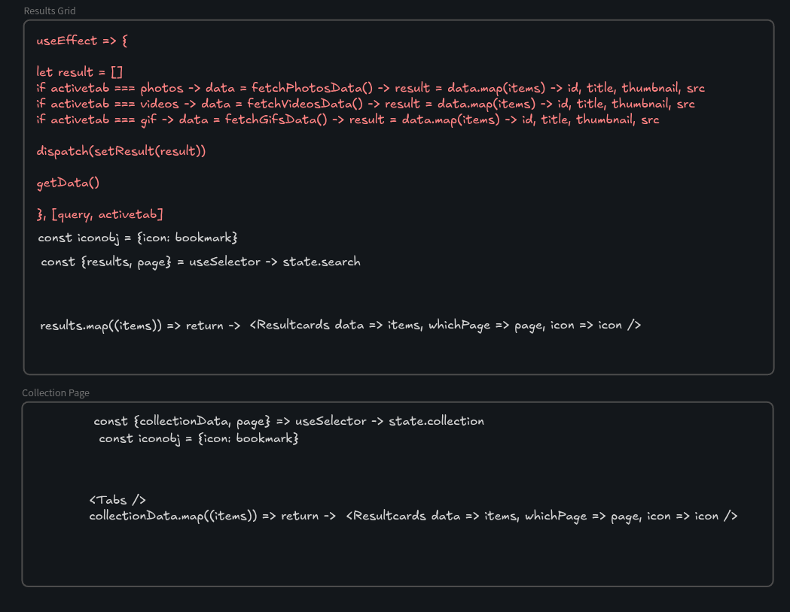
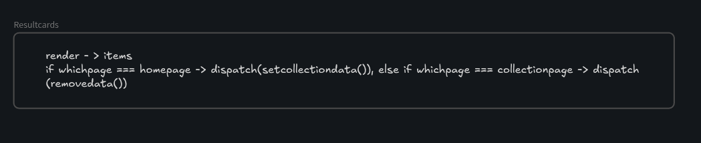

# Media Search App

A modern media search application built with React and Redux Toolkit that allows users to search and explore images, GIFs, and videos from multiple APIs.

## 🚀 Project Overview

This project was created as a Redux Toolkit learning project focused on state management, API handling, and scalable React application structure.

Users can:

* Search for images, GIFs, and videos
* Switch between dedicated media tabs
* Save favorite media items to collections
* Persist collections using Local Storage
* Experience lazy loading for improved performance

---

# 🛠️ Tech Stack

* React
* Redux Toolkit
* Tailwind CSS
* JavaScript
* Axios

---

# 🌐 APIs Used

* Unsplash API (Images)
* Giphy API (GIFs)
* Pexels API (Videos)

---

# ✨ Features

* Global state management using Redux Toolkit
* Media search functionality
* Separate tabs for:

  * Photos
  * GIFs
  * Videos
* Collection page
* Add or remove media from collections
* Local Storage persistence
* Lazy loading
* Reusable component structure
* API integration with async requests

---

# 📁 Folder Structure

```bash
src
├── api
├── assets
├── components
├── pages
├── redux
├── routes
```

### Folder Details

| Folder       | Purpose                                   |
| ------------ | ----------------------------------------- |
| `api`        | API request functions and configuration   |
| `assets`     | Static assets like images/icons           |
| `components` | Reusable UI components                    |
| `pages`      | Application pages/views                   |
| `redux`      | Redux store, slices, and state management |
| `routes`     | Application routing setup                 |

---

# ⚙️ Installation

## 1. Clone the repository

```bash
git clone https://github.com/aakhmakhkout/Media-Search-Redux-Toolkit-Project-.git
```

## 2. Navigate to the project

```bash
cd rtk-project
```

## 3. Install dependencies

```bash
npm install
```

## 4. Start development server

```bash
npm run dev
```

---

# 🔑 Environment Variables

Create a `.env` file in the root directory and add your API keys.

```env
VITE_UNSPLASH_KEY=your_unsplash_api_key
VITE_GIPHY_KEY=your_giphy_api_key
VITE_PEXELS_KEY=your_pexels_api_key
```

---

# 🧠 Redux Toolkit Concepts Used

* createSlice
* configureStore
* useSelector
* useDispatch
* Global state management
* State persistence with Local Storage

---

# 📸 Screenshots

Add screenshots of your application here.

```md







```

---

# 📚 Learning Goals

This project helped in learning:

* Redux Toolkit fundamentals
* Managing global state
* API integration in React
* Local Storage handling
* Component-based architecture
* Lazy loading optimization
* Clean folder structure organization

---

# 👨‍💻 Author

Made by Noumaan Nabi

---

# 📄 License

This project is for learning and anyone can use/fork this.
